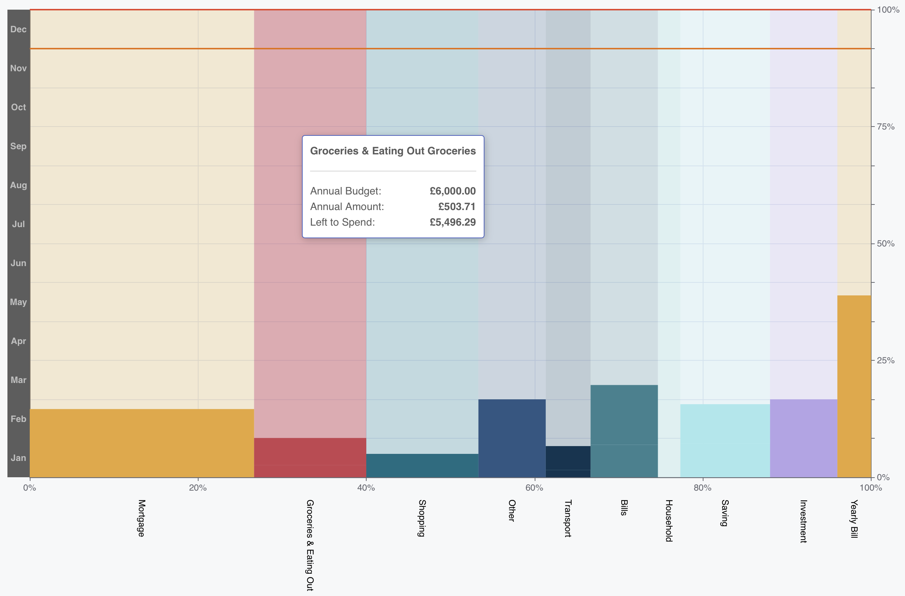

# budget-view-chart

A react Chart component specialising in display budget for personal finance.
> This component is built based on [echarts](https://echarts.apache.org/en/index.html).


[Demo/Playground](https://ileodo.github.io/budget-view-chart/)

<p style="text-align:center;"></p>

# Get Started

```bash
npm install budget-view-chart
```

```react
<BudgetChart config={{
                        year: 2023,
                        month: 10,
                        showCurrentLine: true,
                        showAggregate: false,
                        locale: "en-GB",
                        currency: "GBP"
                    }} value={dataset}/>

```
Example `dataset` can be find in [demo/src/data/](demo/src/data/)


# Contribution

All contributions are welcomed, especially the following aspects:

- Standardise the repo
- Standardise the build/test/linting process
- Support custom styling
- Performance improvements