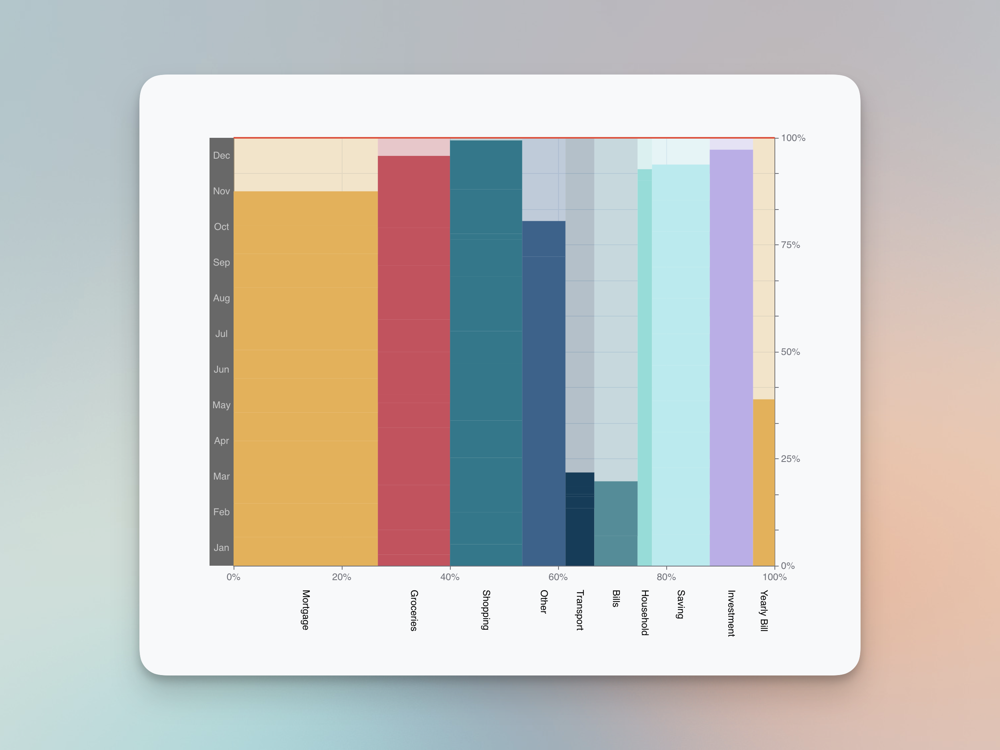
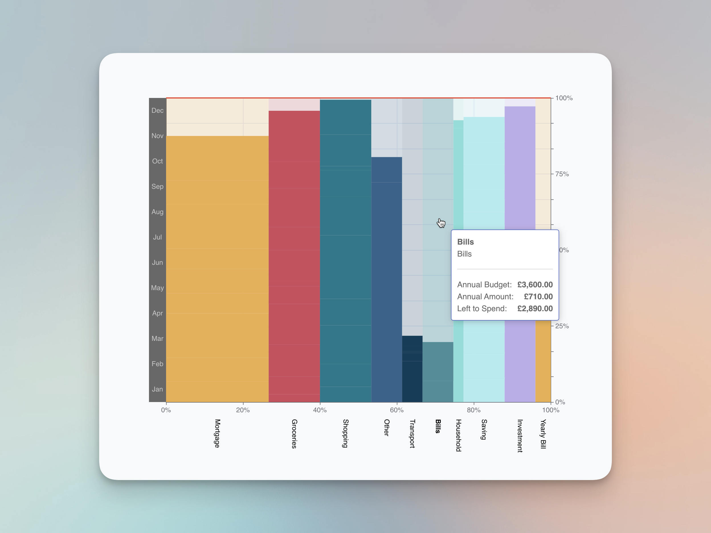
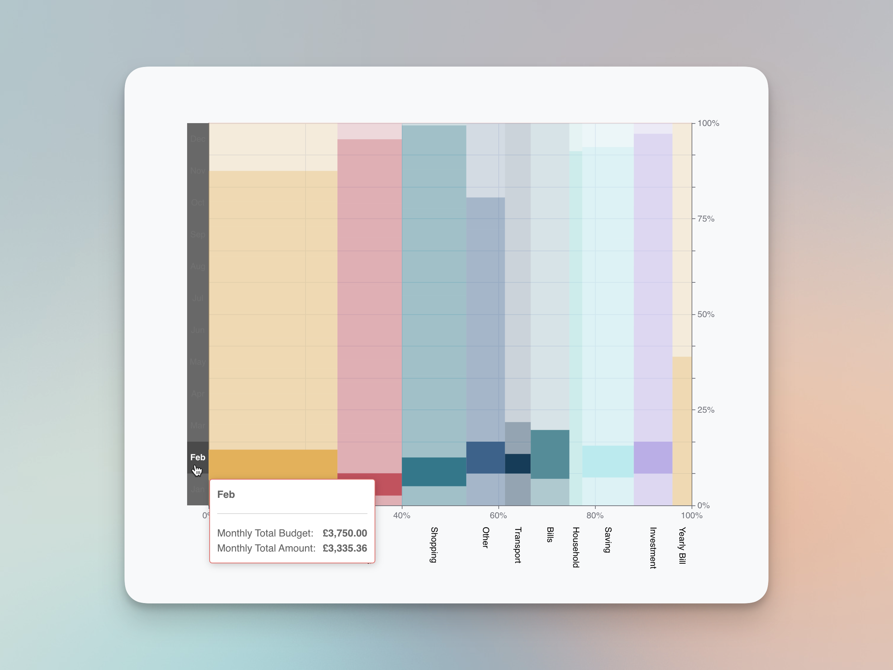
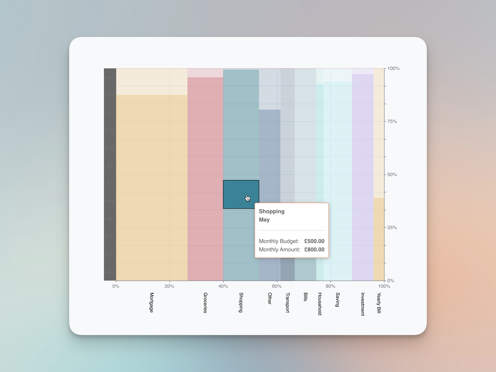
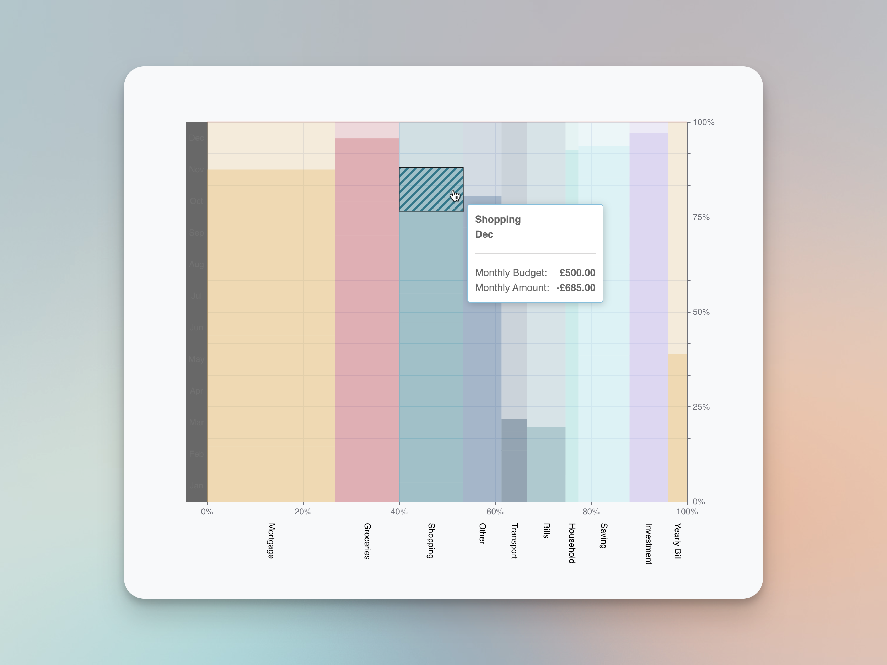
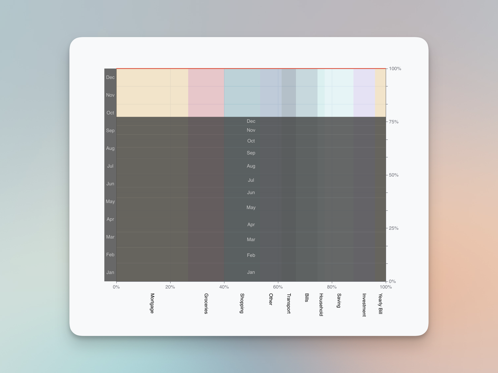
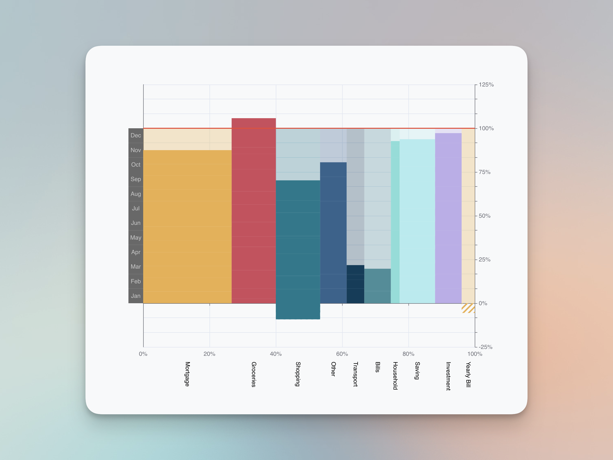
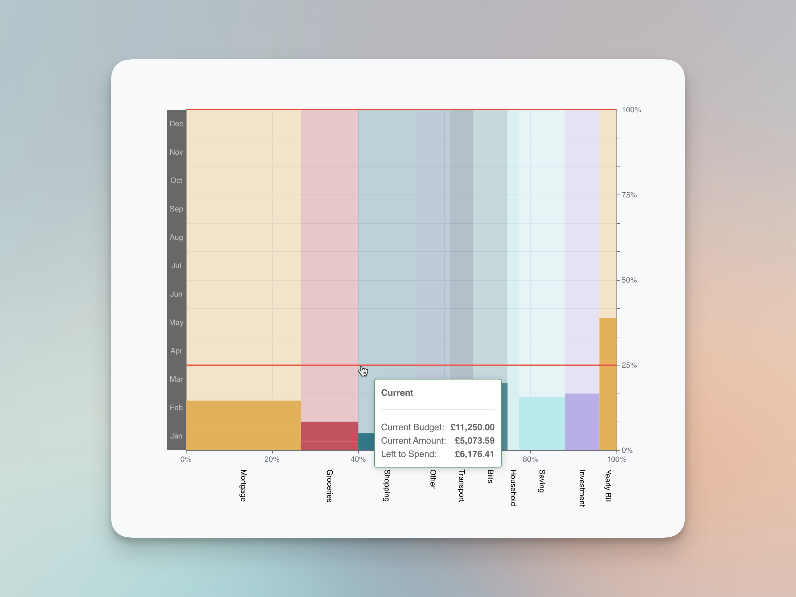

# budget-view-chart

[](https://github.com/ileodo/budget-view-chart/actions/workflows/static.yml)


[](https://www.npmjs.com/package/budget-view-chart)


<a href="https://www.buymeacoffee.com/Ileodo" target="_blank"></a>

A react Chart component specialising in display budget for personal finance.

> This component is built based on [echarts](https://echarts.apache.org/en/index.html).

[![Demo Button Icon]][Demo Link]

[Demo Link]: https://ileodo.github.io/budget-view-chart/
[Demo Button Icon]: https://img.shields.io/badge/Demo-EF2D?style=for-the-badge&logoColor=white


<p style="text-align:center;"></p>

# Get Started

```bash
npm install budget-view-chart
```

```react
<BudgetChart config={{
  showMonthEndLine: null,
  showAggregate: false,
  locale: 'en-GB',
  currency: 'GBP'}} value={dataset}/>

```
Example `dataset` can be find in [demo/src/data/](demo/src/data/)


# Visualisation

Breakdown View
<p style="text-align:center;"></p>

Highlight on Budget Item
<p style="text-align:center;"></p>

Highlight on Spending in a Whole Month
<p style="text-align:center;"></p>

Highlight on Spending
<p style="text-align:center;"></p>

Negative Spending (Income)
<p style="text-align:center;"></p>

Aggregate View
<p style="text-align:center;"></p>

Over Spending
<p style="text-align:center;"></p>

Current Line
<p style="text-align:center;"></p>


# Contribution

All contributions are welcomed, especially the following aspects:

- Standardise the repo
- Standardise the build/test/linting process
- Support custom styling
- Performance improvements
